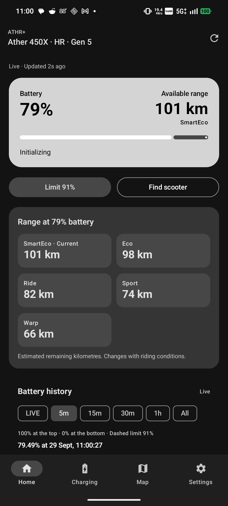
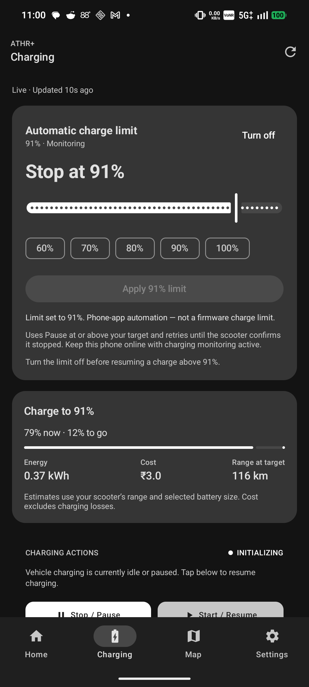
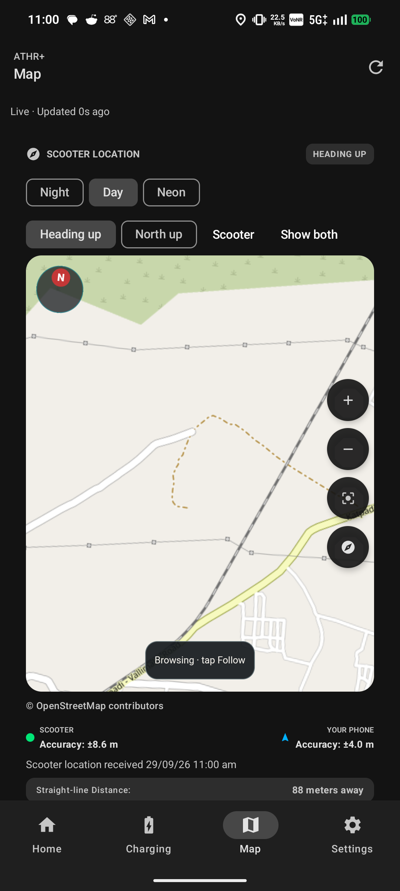
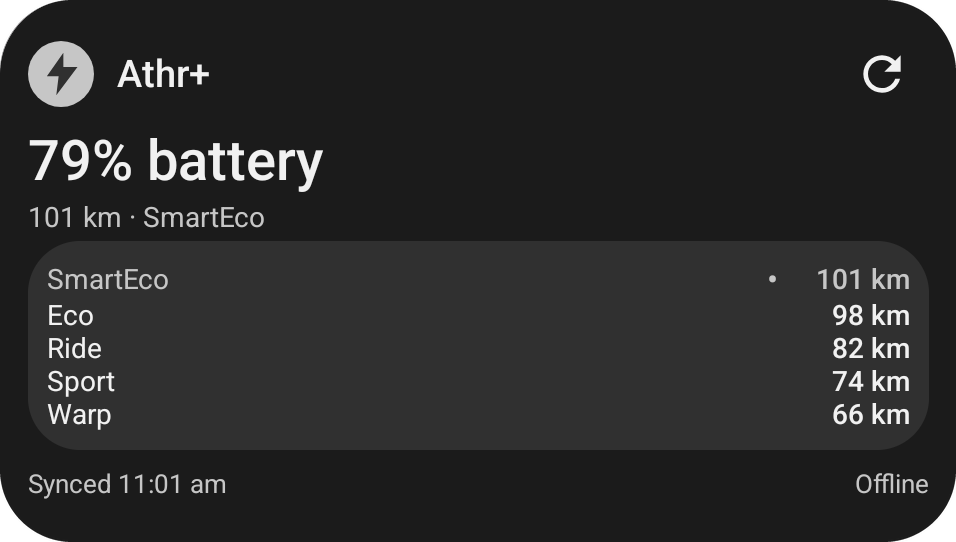

<p align="center">
  
</p>

<h1 align="center">Athr+</h1>

<p align="center">
  <b>An independent, private companion application and widget for smart electric scooters.</b>
</p>

---

## Why This Project Exists

I built **Athr+** because the official app became frustrating to use:

- **Missing from Play Store**: If your phone has an unlocked bootloader or runs a custom ROM, the official app doesn't show up in the Google Play Store.
- **Developer Options Block**: If you keep Developer Options enabled, the app constantly stops you with "Turn off developer options" warnings.
- **Paid for Pro, Couldn't Use It**: Even after paying for the official Ather Pro pack, the app gave a frustrating experience with artificial device blocks.

So I created and open-sourced **Athr+** to give everyone full, unrestricted access to their own scooter—live battery status, smart charging limits, home screen widgets, and ride history—without any annoying device blocks.

---

## Screenshots

| Live Dashboard | Smart Charge Limit | Live Heading Map |
| :---: | :---: | :---: |
|  |  |  |

<p align="center">
  <b>Material You 4×4 Live Home-Screen Widget</b><br/>
  
</p>

---

## Architecture Overview

```text
+-----------------------------------------------------------------------------------+
|                                   USER INTERFACE                                  |
|  +---------------------+  +----------------------+  +--------------------------+  |
|  |   Jetpack Compose   |  |   Material You 4x4   |  |   Leaflet Street Map     |  |
|  |   Dashboard & Tabs  |  |   Live Mode Widget   |  |   (WebView + Heading)    |  |
|  +----------+----------+  +----------+-----------+  +------------+-------------+  |
+-------------|------------------------|---------------------------|----------------+
              |                        |                           |
              v                        v                           v
+-----------------------------------------------------------------------------------+
|                                PRESENTATION LAYER                                 |
|             DashboardViewModel             |         AuthViewModel                |
|       (StateFlow / UI Reducers)            |   (OTP Lifecycle & Selection)        |
+----------------------------------------------+------------------------------------+
                                               |
                                               v
+-----------------------------------------------------------------------------------+
|                                   DOMAIN LAYER                                    |
|  +---------------------+  +----------------------+  +--------------------------+  |
|  | ChargeLimitControl  |  |   Range Estimator    |  |  Battery Health Estimator|  |
|  | (Threshold/Cutoff)  |  | (Live Wh/km anchor)  |  |  (Observed efficiency)   |  |
|  +----------+----------+  +----------+-----------+  +------------+-------------+  |
|             |                        |                           |                |
|  +----------v------------------------v---------------------------v-------------+  |
|  |                     Scooter Repository (Orchestrator)                       |  |
|  +-----------------------------------------------------------------------------+  |
+----------------------------------------------+------------------------------------+
                                               |
                                               v
+-----------------------------------------------------------------------------------+
|                                    DATA LAYER                                     |
|  +---------------------+  +----------------------+  +--------------------------+  |
|  | VehicleApiClient    |  | SecureSessionStore   |  | Room SQLite Database     |  |
|  | (WebSocket + REST)  |  | (AES-256 Encrypted)  |  | (Trips & Telemetry)      |  |
|  +----------+----------+  +----------+-----------+  +------------+-------------+  |
+-------------|------------------------|---------------------------|----------------+
              |                        |                           |
              v                        v                           v
+-----------------------------------------------------------------------------------+
|                              EXTERNAL / OS SERVICES                               |
|  +-------------------------------------+  +------------------------------------+  |
|  |  Foreground Monitoring Service       |  |  WorkManager Periodic Idle Sync    |  |
|  |  (Partial WakeLock during charge)   |  |  (15-min background poll)          |  |
|  +-------------------------------------+  +------------------------------------+  |
|  +-------------------------------------+  +------------------------------------+  |
|  |  Cloud Telemetry & Control API      |  |  Android Keystore & EncryptedPrefs |  |
|  +-------------------------------------+  +------------------------------------+  |
+-----------------------------------------------------------------------------------+
```

---

## Key Features

- **Live Telemetry & Controls**: Real-time bidirectional WebSocket connection providing live SoC, power states, speed, odometer, and estimated mode ranges.
- **Smart Charge Limits**: Automated charge cutoffs at user-selected battery percentages with rate-limited exponential backoff retry policies and partial wake-lock support.
- **Dynamic Mode Range Calculations**: Live remaining range derived from actual real-time consumption anchors across all vehicle modes (Eco, SmartEco, Ride, Sport, Warp, Warp+).
- **Interactive Street Map**: Integrated vector map supporting true-north and heading-up orientations, device compass synchronization, and vehicle tracking.
- **Material You Dynamic Widgets**: Responsive 4×4 and compact home-screen widgets reflecting real-time battery status, per-mode range, and offline indicators.
- **Encrypted Local Storage**: Zero-cloud-credential persistence using Android Keystore and AES-256 GCM `EncryptedSharedPreferences`.
- **Offline Trip & Battery Analytics**: Local Room SQLite storage preserving historical ride logs, efficiency metrics (km/kWh), and battery degradation trends.

---

## Tech Stack & Dependencies

- **Language & Runtime**: Kotlin 1.9+, Java 17, Android SDK 34 (Android 14)
- **UI Framework**: Jetpack Compose with Material 3 (Material You)
- **Networking**: OkHttp 4.12 (WebSocket + HTTP/2 client), Gson
- **Local Persistence**: Android Jetpack Room 2.6 with KSP compiler
- **Security**: AndroidX Security-Crypto 1.1.0 (AES-256 GCM / AES-256 SIV)
- **Background Automation**: AndroidX WorkManager 2.9 & Foreground Services
- **Mapping**: Leaflet 1.9 + Leaflet Rotate inside hardware-accelerated WebView

---

## How to Build & Compile

### 1. Prerequisites

Ensure you have the following installed on your development machine:
- **JDK 17** (e.g. OpenJDK 17 or Eclipse Temurin 17)
- **Android SDK** (API Level 34 with Android SDK Build-Tools `34.0.0`)
- **Android Command-line Tools** or **Android Studio Hedgehog / Jellyfish / Ladybug**

Set your environment variables in your shell configuration (`~/.bashrc` or `~/.zshrc`):

```sh
export JAVA_HOME=/path/to/jdk-17
export ANDROID_HOME=$HOME/Android/Sdk
export PATH=$PATH:$ANDROID_HOME/platform-tools:$ANDROID_HOME/cmdline-tools/latest/bin
```

### 2. Configure Local Properties

Create `android/local.properties` (if not already present):

```properties
sdk.dir=/home/your-user/Android/Sdk
```

### 3. Compile & Assemble Release APK

Run the Gradle wrapper inside the project root:

```sh
# Set JAVA_HOME and compile the optimized release APK
JAVA_HOME=/path/to/jdk-17 ./android/gradlew -p android assembleRelease
```

The compiled release APK will be generated at:
```text
android/app/build/outputs/apk/release/app-release.apk
```

### 4. Build Variants & Useful Gradle Tasks

```sh
# Assemble Debug APK
./android/gradlew -p android assembleDebug

# Run all unit tests
./android/gradlew -p android test

# Run Android Lint checks
./android/gradlew -p android lintRelease

# Clean build directory
./android/gradlew -p android clean
```

---

## Testing & Verification

The project includes unit and end-to-end integration tests:

1. **Unit Test Suite (121 tests)**:
   ```sh
   ./android/gradlew -p android test
   ```
   Validates telemetry parsing, charging cutoff algorithms, backoff retries, and range estimators.

2. **Map Gesture & Browser Verification**:
   ```sh
   # Requires Node.js 20+ and Chromium
   node scripts/test-map.mjs
   ```
   Exercises map rotations, heading synchronization, pinch gestures, and theme persistence.

3. **Database Migration Verifier**:
   ```sh
   python3 scripts/test-migration.py
   ```
   Ensures seamless SQLite schema upgrades without losing user history.

---

## Project Structure

```text
android/
  app/
    src/
      main/
        java/io/athr/pro/
          data/          # Network APIs, WebSockets, Room Database & Secure Store
          domain/        # Business logic, charging rules & range calculators
          presentation/  # Jetpack Compose ViewModels & state holders
          service/       # Foreground charge monitor & WorkManager tasks
          ui/            # Compose screens, themes, and navigation
          widget/        # Home-screen widget provider & renderers
        assets/          # Bundled Leaflet mapping engine & CSS styles
        res/             # Adaptive icons, layouts, and Material You drawables
      test/              # Comprehensive test suites & JSON telemetry fixtures
scripts/                 # Headless browser, schema migration & update scripts
docs/                    # Technical architecture & release notes
```

---

## Security & Privacy Design

- **Zero Hardcoded Credentials**: No embedded API keys, secret tokens, or passwords exist anywhere in the codebase.
- **Direct End-to-End Auth**: Sign-in is initiated directly by the user via mobile OTP verification.
- **Hardware-Backed Encryption**: Session tokens and vehicle identifiers are saved locally in encrypted storage backed by the device Keystore.
- **Local-First Privacy**: Ride analytics and charging logs remain on your device and are never sent to third-party tracking services.

---

## Legal Notice & Disclaimer

> [!NOTE]
> **Notice**: This application was developed independently using exclusively publicly available information, standard open network protocols, and resources accessible online. It contains no proprietary source code, confidential intellectual property, or trade secrets.
>
> This project is completely independent and is not affiliated with, authorized, maintained, sponsored, or endorsed by any vehicle manufacturer, automotive brand, or corporate entity. All trademarks, service marks, trade names, and product names are the property of their respective owners. The software is provided solely for personal interoperability, research, educational, and hobbyist purposes.

